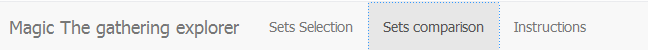
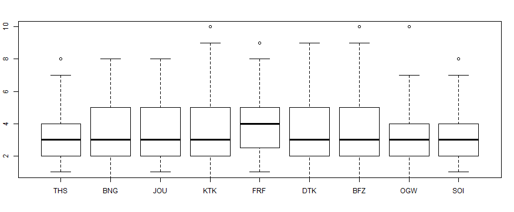
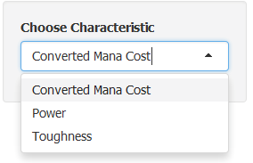
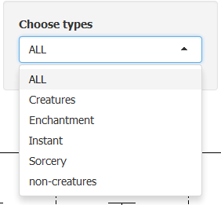
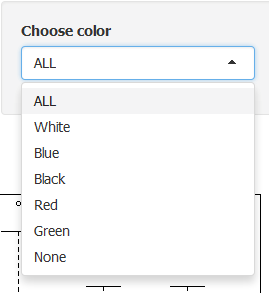
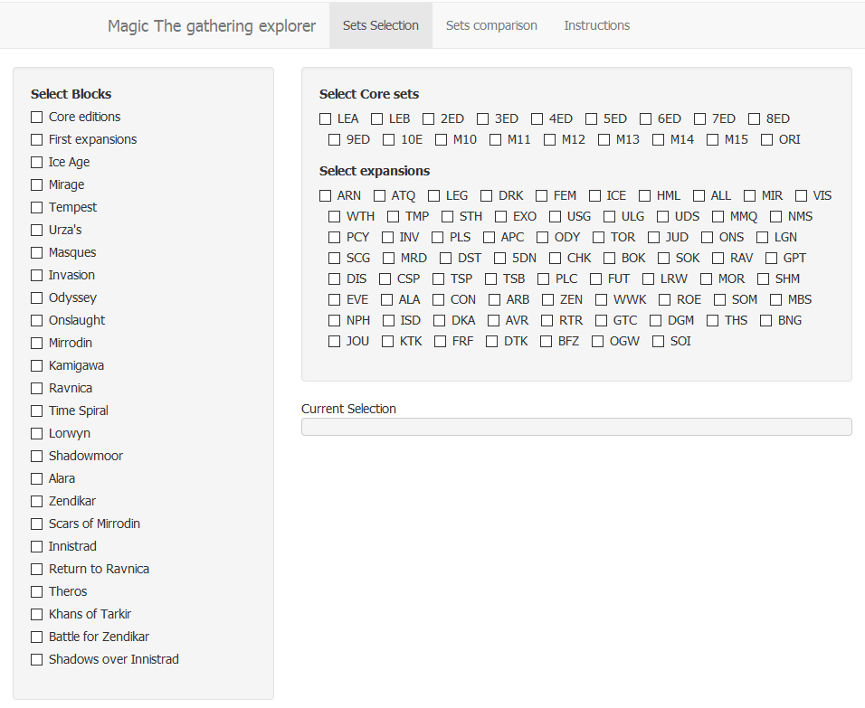

## What is magic the gathering ?

Magic the Gathering is a card game that puts together best of chess and poker.

Every quarter, there is between 150 to 300 new cards with new gameplay. Cards are grouped by expansions and blocks (2 to 3 expansions).

One way to play is to only use the two latests block (format standard) and since cards change 6 months, winning strategy are never the same.

Since Magic is more than 20 years old, it is very useful to compare new expansions with older ones to find potential wining strategies, and "Magic The Gathering Explorer" aims to help player to do so.

Number of magic expansions :


```
## [1] 193
```


--- .class #id1 

## Application introduction

There is 3 tab panels




- Sets selection :
This panel allows to select one or more expansions with checkboxes. Expansions can be selected/unselected by clicking on blocks

- Sets comparison :
This is the main part of the application. This panel shows boxplots of one characteristics for every expansions. Results can be filtered by cards types or color.


- Instructions : 
This panel just gives a small set of instructions on how to use the application


--- .class #id2

## Sets comparison graphic

Graphic consist in boxplots with box around average being 2nd and 3rd quartile.

Example :


--- .class #id3


## Options





--- .class #id4

## Expansions, Core sets and blocks


## END 
